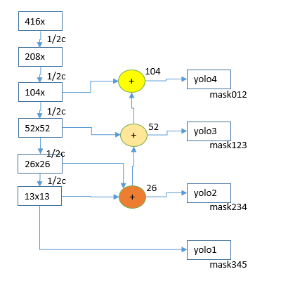

# B0-4Y : EfficientNetB0 + 4 YOLO Layers on darknet AlexeyAB  

EfficientNetB0 for classifier(AKA Backbone) and 4 YOLO Layers for detector on darknet Framework.  
- [enet4y2](./cfg/enet4y2-coco.cfg) with 4.146BFlops to calculate convolution layers  
- 20MB weights file size  
- 20days @ V100 GPU for taining with COCO  
- 47.1 mAP50 with COCO 5K  

**enet4y2 network structure**  

  

The original [cfg](./cfg/enet-coco.cfg) which on [AlexeyAB](https://github.com/AlexeyAB/darknet) includes 2 YOLO Layers as detector.  
enet4y2 and the original enet-coco have same backbone classifier therefore use [same backbone weights](https://github.com/WongKinYiu/CrossStagePartialNetworks).  

**original [README](./README.orig.md)**  

## Object Detector from Dataset download until estimation mAP  

### Download Dataset  

```
$ mkdir work;cd work
$ ./scripts/get_coco_dataset.sh
```


### Training using backbone weights pre-trained via ImageNet  

**[backbone weigts](https://github.com/WongKinYiu/CrossStagePartialNetworks)**  
This weights of classifier may be generated for [Cross Stage Partial Networks](https://github.com/WongKinYiu/CrossStagePartialNetworks).  

**[enet4y2-coco weights](./backup4y2/enet4y2-coco_final.weights)**  
This weights of detector is generated for [enet4y2-coco.cfg](cfg/enet4y2-coco.cfg).  

- write coco.data  
```
classes = 80
train   = work/coco/trainvalno5k.txt
valid   = work/coco/5k.txt
names   = data/coco.names
backup  = backup4y2
```

- download backbone weights 'enetb0_final.weights' [from Website](https://github.com/WongKinYiu/CrossStagePartialNetworks)  

- start training  
```
$ ./darknet detector train coco.data cfg/enet4y2-coco.cfg enetb0_final.weights  
```
Unfortunately wait 20days even if V100 GPGPU.  

### enet4y2-coco estimation mAP against enet-coco(detector as reference)  

**Summary via pycocotools**  

| /            | AP50-95 | AP50     | AP75     | Small     | Medium | Large     | Judgement |
|-             |-:       |-:        |-:        |-:         |-:      |-:         |-:         |
|enet-coco     |0.240    |0.452     |**0.231** |0.086      |0.260   |**0.369**  |criterion  |
|enet4y2-coco  |0.236    |**0.471** |0.213     |**0.091**  |0.258   |0.339      |target     |
|              |even     |win       |lose      |win(?)     |even    |lose       |result     |

**enet4y2-coco.cfg pycocotools details**  

```
$ ./darknet detector map coco.data cfg/enet4y2-coco.cfg backup4y2/enet4y2-coco_final.weights
$ ./scripts/pycocoeval.py -r results/coco_results.json -g work2/coco/annotations/instances_val2014.json

0.23648480928288304
 Average Precision  (AP) @[ IoU=0.50:0.95 | area=   all | maxDets=100 ] = 0.236
 Average Precision  (AP) @[ IoU=0.50      | area=   all | maxDets=100 ] = 0.471
 Average Precision  (AP) @[ IoU=0.75      | area=   all | maxDets=100 ] = 0.213
 Average Precision  (AP) @[ IoU=0.50:0.95 | area= small | maxDets=100 ] = 0.091
 Average Precision  (AP) @[ IoU=0.50:0.95 | area=medium | maxDets=100 ] = 0.258
 Average Precision  (AP) @[ IoU=0.50:0.95 | area= large | maxDets=100 ] = 0.339
 Average Recall     (AR) @[ IoU=0.50:0.95 | area=   all | maxDets=  1 ] = 0.222
 Average Recall     (AR) @[ IoU=0.50:0.95 | area=   all | maxDets= 10 ] = 0.346
 Average Recall     (AR) @[ IoU=0.50:0.95 | area=   all | maxDets=100 ] = 0.371
 Average Recall     (AR) @[ IoU=0.50:0.95 | area= small | maxDets=100 ] = 0.181
 Average Recall     (AR) @[ IoU=0.50:0.95 | area=medium | maxDets=100 ] = 0.401
 Average Recall     (AR) @[ IoU=0.50:0.95 | area= large | maxDets=100 ] = 0.519
```

**progress bar while training**  
can see training progress bar with ./scripts/avgout.py like below,  
```
loss range: 3002.268311 to 3.872015
-----------------------------------------------------------------------------------------------------------
|  iteration         loss                                       bar                                       |
-----------------------------------------------------------------------------------------------------------
       13983     6.768050 ################################################################################|
       27995     5.574761 ##########################################################################
       42005     5.929069 ##############################################################################
       56015     5.440513 ########################################################################
       70026     5.273204 ######################################################################
       84036     5.494036 #########################################################################
       98046     5.522543 #########################################################################
      112058     5.210263 #####################################################################
      126068     5.341331 #######################################################################
      140081     5.041574 ###################################################################
      154091     5.278211 ######################################################################
      168103     5.333329 #######################################################################
      182114     5.006047 ##################################################################
      196124     4.866174 ################################################################
      210135     4.911802 #################################################################
      224145     4.948373 #################################################################
      238156     4.968527 ##################################################################
      252167     4.585942 #############################################################
      266178     4.541975 ############################################################
      280189     4.465081 ###########################################################
-----------------------------------------------------------------------------------------------------------
MIN   277615     3.872015 >>>>>>>>>>>>>>>>>>>>>>>>>>>>>>>>>>>>>>>>>>>>>>>>>>>
-----------------------------------------------------------------------------------------------------------
```
watch -n 5 'avgout.py log' script is easy way to check status of training everyday.  

