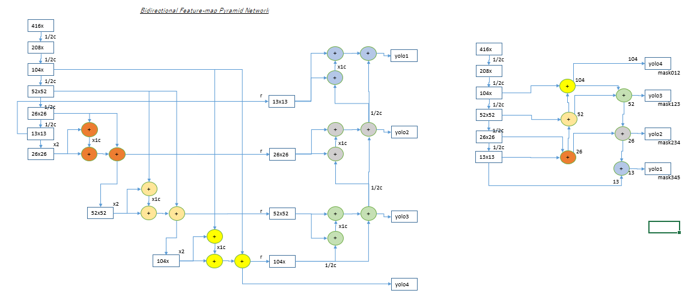

# B0-4Y : EfficientNetB0 + 4 YOLO Layers + BiFPN on darknet AlexeyAB  

EfficientNetB0 for classifier(AKA Backbone) and 4 YOLO Layers + BiFPN for detector on darknet Framework.  
- [enet4y2bifpn](./cfg/enet4y2bifpn-coco.cfg) with 4.364 to calculate convolution layers  
- [enet4y2bifpn](./cfg/enet4y2bifpn-coco.cfg) has Bidirectional Feature Pylamid Network
- 20MB weights file size  
- 20days @ V100 GPU for taining with COCO  
- 49.5 mAP50 with COCO 5K  
- 81.0 mAP50 with VOC2007 test(as additional information)  

**enet4y2bifpn network structure**  

  

The original [cfg](./cfg/enet-coco.cfg) which on [AlexeyAB](https://github.com/AlexeyAB/darknet) includes 2 YOLO Layers as detector.  
enet4y2bifpn and the original enet-coco have same backbone classifier therefore use [same backbone weights](https://github.com/WongKinYiu/CrossStagePartialNetworks).  

**original [README](./README.orig.md)**  

## Object Detector setup from Dataset download until estimation mAP  

### Download Dataset  

```
$ mkdir work;cd work
$ ./scripts/get_coco_dataset.sh
```


### Training using backbone weights pre-trained via ImageNet  

**[backbone weigts](https://github.com/WongKinYiu/CrossStagePartialNetworks)**  
This weights of classifier may be generated for [Cross Stage Partial Networks](https://github.com/WongKinYiu/CrossStagePartialNetworks).  

**[enet4y2bifpn-coco weights](./backup4y2/enet4y2bifpn-coco-bigBatch_final.weights)**  
This weights of detector is generated for [enet4y2bifpn-coco.cfg](./cfg/enet4y2bifpn-coco.cfg).  

- write coco.data  
```
classes = 80
train   = work/coco/trainvalno5k.txt
valid   = work/coco/5k.txt
names   = data/coco.names
backup  = backup4y2
```

- download backbone weights 'enetb0_final.weights' [from Website](https://github.com/WongKinYiu/CrossStagePartialNetworks)  

- start training  
using 24batch size.  
```
$ ./darknet detector train coco.data cfg/enet4y2bifpn-coco.cfg enetb0_final.weights  
```
Unfortunately wait 20days even if V100 GPGPU.  

### [enet4y2bifpn-coco](./cfg/enet4y2bifpn-coco-bigBatch.cfg) estimation mAP against enet-coco(detector as reference)  

*Notice:using 64batch size*  

**Summary via pycocotools**  

| /                 | AP50-95 | AP50     | AP75     | Small     | Medium  | Large     | Judgement |
|-                  |-:       |-:        |-:        |-:         |-:       |-:         |-:         |
|enet-coco          |0.240    |0.452     |0.231     |0.086      |0.260    |**0.369**  |[criterion](./backup4y2/enetb0-coco_final.weights)  |
|enet4y2-coco       |0.236    |**0.471** |0.213     |**0.091**  |0.258    |0.339      |target     |
|enet4y2bifpn-coco  |**0.255**|**0.495** |**0.241** |**0.099**  |**0.279**|0.363      |target     |
|                   |win      |win       |win       |win        |win      |lose       |result     |  

**enet4y2bifpn-coco.cfg pycocotools details**  

```
$ ./darknet detector map coco.data cfg/enet4y2bifpn-coco.cfg backup4y2/enet4y2bifpn-coco-bigBatch_final.weights
$ ./scripts/pycocoeval.py -r results/coco_results.json -g work2/coco/annotations/instances_val2014.json

0.25474642780790624
 Average Precision  (AP) @[ IoU=0.50:0.95 | area=   all | maxDets=100 ] = 0.255
 Average Precision  (AP) @[ IoU=0.50      | area=   all | maxDets=100 ] = 0.495
 Average Precision  (AP) @[ IoU=0.75      | area=   all | maxDets=100 ] = 0.241
 Average Precision  (AP) @[ IoU=0.50:0.95 | area= small | maxDets=100 ] = 0.099
 Average Precision  (AP) @[ IoU=0.50:0.95 | area=medium | maxDets=100 ] = 0.279
 Average Precision  (AP) @[ IoU=0.50:0.95 | area= large | maxDets=100 ] = 0.363
 Average Recall     (AR) @[ IoU=0.50:0.95 | area=   all | maxDets=  1 ] = 0.229
 Average Recall     (AR) @[ IoU=0.50:0.95 | area=   all | maxDets= 10 ] = 0.354
 Average Recall     (AR) @[ IoU=0.50:0.95 | area=   all | maxDets=100 ] = 0.377
 Average Recall     (AR) @[ IoU=0.50:0.95 | area= small | maxDets=100 ] = 0.189
 Average Recall     (AR) @[ IoU=0.50:0.95 | area=medium | maxDets=100 ] = 0.409
 Average Recall     (AR) @[ IoU=0.50:0.95 | area= large | maxDets=100 ] = 0.515
```

### [enet4y2bifpn-voc](./cfg/enet4y2bifpn-voc.cfg) estimation mAP as additional information  

**[enet4y2bifpn-voc weights](./backup4y2VOC/enet4y2bifpn-voc_best.weights)**  

**Summary via darknet map**  

| /                 | AP50    |
|-                  |-:       |
|enet4y2-voc        |0.792    |
|enet4y2bifpn-voc   |**0.810**|

```
./darknet detector map voc.data cfg/enet4y2bifpn-voc.cfg backup4y2VOC/enet4y2-voc_best.weights
class_id = 0, name = aeroplane, ap = 89.30%      (TP = 235, FP = 31)
class_id = 1, name = bicycle, ap = 89.56%        (TP = 277, FP = 48)
class_id = 2, name = bird, ap = 80.07%           (TP = 350, FP = 81)
class_id = 3, name = boat, ap = 70.80%           (TP = 181, FP = 94)
class_id = 4, name = bottle, ap = 68.20%         (TP = 314, FP = 159)
class_id = 5, name = bus, ap = 90.40%            (TP = 182, FP = 41)
class_id = 6, name = car, ap = 89.76%            (TP = 1039, FP = 232)
class_id = 7, name = cat, ap = 89.56%            (TP = 302, FP = 48)
class_id = 8, name = chair, ap = 64.18%          (TP = 511, FP = 441)
class_id = 9, name = cow, ap = 84.06%            (TP = 207, FP = 72)
class_id = 10, name = diningtable, ap = 71.67%           (TP = 156, FP = 102)
class_id = 11, name = dog, ap = 85.62%           (TP = 398, FP = 111)
class_id = 12, name = horse, ap = 90.50%         (TP = 303, FP = 59)
class_id = 13, name = motorbike, ap = 89.71%     (TP = 272, FP = 73)
class_id = 14, name = person, ap = 85.57%        (TP = 3635, FP = 804)
class_id = 15, name = pottedplant, ap = 52.73%           (TP = 252, FP = 178)
class_id = 16, name = sheep, ap = 84.67%         (TP = 203, FP = 49)
class_id = 17, name = sofa, ap = 75.92%          (TP = 191, FP = 125)
class_id = 18, name = train, ap = 86.33%         (TP = 234, FP = 56)
class_id = 19, name = tvmonitor, ap = 81.50%     (TP = 249, FP = 74)

 for conf_thresh = 0.25, precision = 0.77, recall = 0.79, F1-score = 0.78
 for conf_thresh = 0.25, TP = 9491, FP = 2878, FN = 2541, average IoU = 59.83 %

 IoU threshold = 50 %, used Area-Under-Curve for each unique Recall
 mean average precision (mAP@0.50) = 0.810054, or 81.01 %
```

## FPN Version, read [next](./README.fpn.md)  
## Getting start from scratch without pre-trained backbone, read [next](./README.classifier.md)  
## Convertion from darknet to pytorch and tensorflow [next](./README.convert.md)  
